# Workshop estate GIS 2021 UNIPD

Per domande clicca su PARTECIPA: <br>
[](https://github.com/pigreco/workshop-estate-gis-2021/discussions)

---

**INDICE**

<!-- TOC -->

- [Workshop estate GIS 2021 UNIPD](#workshop-estate-gis-2021-unipd)
  - [Titolo](#titolo)
  - [Relatori](#relatori)
  - [Data, luogo e durata](#data-luogo-e-durata)
  - [Piattaforme e Software](#piattaforme-e-software)
  - [Programma](#programma)
  - [QGIS e il WMS AdE](#qgis-e-il-wms-ade)
  - [link utili](#link-utili)
  - [Contatti](#contatti)
    - [Andrea Borruso](#andrea-borruso)
    - [Totò Fiandaca](#totò-fiandaca)
  - [Risultati evento](#risultati-evento)
  - [Domande finali](#domande-finali)
- [Workshop WMS Catasto AdE in QGIS](#workshop-wms-catasto-ade-in-qgis)
  - [Decorazione Etichetta Titolo](#decorazione-etichetta-titolo)
    - [Espressione utilizzata](#espressione-utilizzata)
  - [Servizio WMS](#servizio-wms)
    - [Come aggiungere il Servizio WMS a QGIS](#come-aggiungere-il-servizio-wms-a-qgis)
    - [Quali dati espone il servizio WMS](#quali-dati-espone-il-servizio-wms)
    - [SR disponibili per il WMS](#sr-disponibili-per-il-wms)
    - [Layer disponibili nel WMS](#layer-disponibili-nel-wms)
  - [Creare un nuovo GeoPackage](#creare-un-nuovo-geopackage)
  - [Impostazioni Progetto](#impostazioni-progetto)
  - [Espressione personalizzata](#espressione-personalizzata)
  - [campi virtuali](#campi-virtuali)
    - [casi possibili](#casi-possibili)
  - [Digitalizzazione particelle](#digitalizzazione-particelle)
    - [Plugin GIMP Selection Feature](#plugin-gimp-selection-feature)
      - [Osservazioni](#osservazioni)
      - [Workflow](#workflow)
    - [Plugin Magic Wand](#plugin-magic-wand)
      - [Workflow](#workflow-1)
    - [estrarre dati dai poligoni](#estrarre-dati-dai-poligoni)
- [Cosa occorre](#cosa-occorre)
  - [Software da installare](#software-da-installare)
  - [Plugin da installare](#plugin-da-installare)
- [Caratteristiche utilizzate nel progetto](#caratteristiche-utilizzate-nel-progetto)
- [Riferimenti utili](#riferimenti-utili)
- [Cosa c'è in questo repo](#cosa-cè-in-questo-repo)
- [Video demo](#video-demo)
- [Licenza](#licenza)
  - [Prossimi eventi](#prossimi-eventi)

<!-- /TOC -->

---

## Titolo

**TITOLO**: <br> Il WMS del catasto dell'Agenzia delle Entrate: licenza, come usarlo in [QGIS](https://qgis.org/it/site/), come aggiungere il servizio WMS, come estrarre i dati e digitalizzare le particelle.

**DESCRIZIONE**: <br> Obiettivo di questo workshop è quello di evidenziare le potenzialità delle analisi geografiche usando **opendata** e software **Open Source**. Realizzeremo un progetto **QGIS** utilizzando, come fonte dei dati, il WMS dell'AdE e vedremo come aggiungere il servizio WMS, come estrarre i dati esposti usando il filed calc, e infine come digitalizzare velocemente le particelle catastali usando vari plugin.

<p align="center"><a href="https://www.mastergiscience.it/2021/05/09/estate-gis-2021/" target="_blank">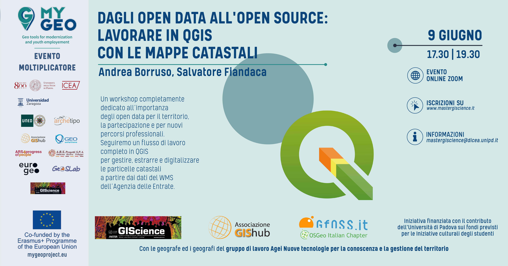</a></p>

---

[](https://github.com/pigreco/seminario-estate-gis-2020/blob/master/license)
[](https://github.com/pigreco/seminario-estate-gis-2020/commits/master)

## Relatori

- 🧔 [**Andrea BORRUSO**](https://twitter.com/aborruso) <br>(Membro [OpenDataSicilia](http://opendatasicilia.it/) (2014), Presidente [onData](https://ondata.it/) (2015))

<!--<p align="center"><a href="" target="_blank">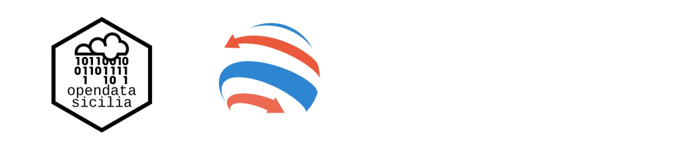</a></p>-->

- 👨‍🦲 **Totò FIANDACA** <br>(Membro [OpenDataSicilia](http://opendatasicilia.it/) (2014) , Membro [QGIS Italia](http://qgis.it/) (2015), Socio [GFOSS.it](https://gfoss.it/) (2017), Membro [QGIS organization](https://github.com/qgis) (2020))

## Data, luogo e durata

- 🗓 09/06/2021 con orario 🕟 17:30 🕢 19:30 
- 🌐 on-line
- ⏳ 2️⃣ ore

## Piattaforme e Software

- [ZOOM](https://zoom.us/) - per diretta web
- Windows 10 64b - come SO
- [`QGIS 3.16 Hannover`](https://qgis.org/it/site/)  e Plugin [`Gimp Selection feature`](https://github.com/lmotta/gimpselectionfeature_plugin/wiki) e [`Magic Wand`](https://plugins.qgis.org/plugins/MagicWand-master/)
- GIMP 2.10 

## Programma

1. Presentazione iniziale da parte degli organizzatori;
2. **Andrea Borruso:**
   1.  introduzione agli opendata;
   2.  il WMS del Catasto dell'AdE: la licenza prima e dopo del 24/09/2020;
   3.  cosa possiamo farci con il WMS: con QGIS o via script;
3. **Totò Fiandaca:**
   1. come aggiungere il WMS del catasto AdE in QGIS;
   2. come usarle il WMS come layer;
   3. quali layer sono presenti nel WMS e a quale scala sono visibili;
   4. quali SR sono disponibili nel WMS;
   5. come fare una semplice interrogare del WMS in QGIS;
   6. quali dati espone il WMS;
   7. come estrarre i dati esposti dal WMS;
   8. come creare/usare espressioni personalizzate;
   9.  come digitalizzare le particelle in modo veloce;
   10. quali plugin usare per estrarre le particelle;


[↑ torna su ↑](#workshop-estate-gis-2021-unipd)

## QGIS e il WMS AdE

<p align="center"><a href="https://qgis.org/it/site/" target="_blank"></a></p>


[↑ torna su ↑](#workshop-estate-gis-2020-unipd)

## link utili

- **URL servizio WMS** : https://wms.cartografia.agenziaentrate.gov.it/inspire/wms/ows01.php
- **PDF su WMS** : <https://www.agenziaentrate.gov.it/portale/documents/20143/260417/Manuale+consultazione+cartografia_Documentazione+descrittiva+del+servizio+di+consultazione+della+cartografia+catastale+20180611.pdf/35e955f7-2344-56c8-1157-8f7567531660>
- **Capabilities** : <https://wms.cartografia.agenziaentrate.gov.it/inspire/wms/ows01.php?SERVICE=WMS&VERSION=1.3.0&REQUEST=GetCapabilities>
- **Pagina con URL e licenza** : https://www.agenziaentrate.gov.it/portale/web/guest/schede/fabbricatiterreni/consultazione-cartografia-catastale/servizio-consultazione-cartografia
- **espressione personalizzata**: <https://gist.github.com/pigreco/86589dddf5a59b3a7650267d5af237bd>

---

## Contatti

### Andrea Borruso

* ✉ **Mail**: <andrea.borruso@ondata.it>
* **Twitter**: <https://twitter.com/aborruso>
* **slide**: <https://docs.google.com/presentation/d/1tN3uqunt73aDN_R4R-WmbcOlI9V798yuNh7VcRFamvg/edit#slide=id.gdf3b5aaf47_0_7>

### Totò Fiandaca

* ✉ **Mail**: <pigrecoinfinito@gmail.com>
* **Twitter**: <https://twitter.com/totofiandaca>
* **Canale Telegram**: <https://t.me/pigrecoinfinito>
* **Youtube** : <https://youtu.be/am9_zMbGofY>

---

## Risultati evento

- **430** iscritti
- **246** max partecipanti (ZOOM + Facebook)
- diretta Facebook : <https://fb.watch/60JOKALWuj/>

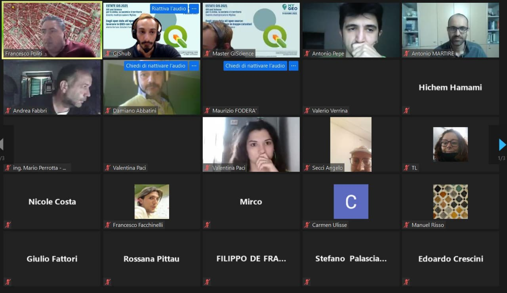


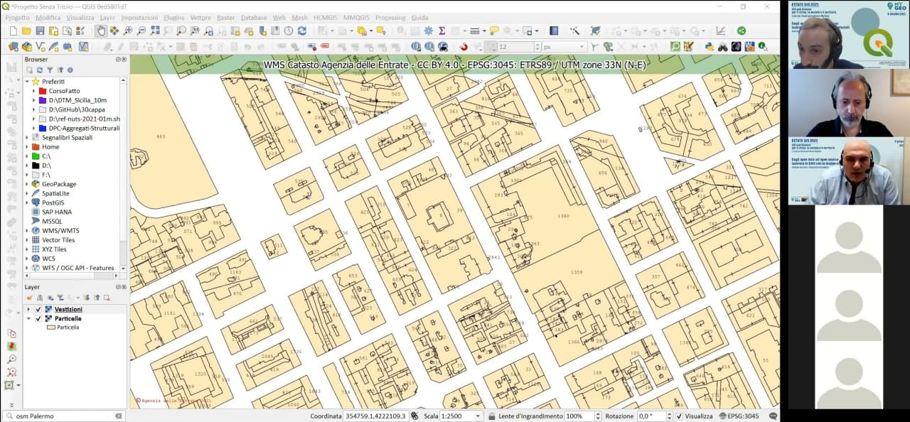

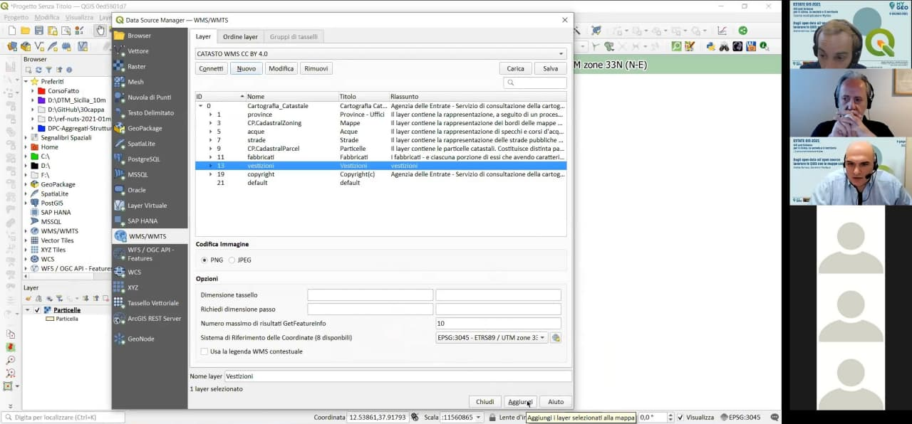

[↑ torna su ↑](#workshop-estate-gis-2021-unipd)

## Domande finali

1. **R. Brascugli chiede:** Il codice Py funziona anche se il layer particelle non è visibile?
   1. dal test effettuato in diretta, sembra di sì; ma non ha molto senso farlo.
2. **Ing. Mario Perrotta:** I campi del vettore ottenuto da GIMP come sono definiti?
   1. la documentazione è presente in questo repository, oppure nel repository del plugin.
3. **Alberto Gallo chiede:** É possibile ripetere il passaggio per creare il campo catasto (get_info_2)?
   1. fatto nella diretta.
4. **Maria Rosa Tremiterra chiede:** Questi metodi di vettorializzazione possono comportare errori topolgici?
   1. In generale no, ma in capi particolari potrebbero esserci.
5. **Salvatore Falanga Bolognesi chiede:** Come mai a partire da dati catastali grezzi (CXF) non riesco ad ottenere la stessa precisione nella georeferenziazione? I tool da me utilizzati sono quelli standard di QGIS (CXF import) e successivamente il software ConveRGo (senza l’utilizzo di grigliati). Il problema sono i tool e/o i dati ancillari?
   1. domanda OFF Topic
6. **Antonio Martire chiede:** È possibile da QGIS (ed eventuale plugin) esportare la rappresentazione grafica del WMS Catasto, in vettoriale disegno, con estensione dxf o dwg?
   1. È possibile esportare il raster e non il vettore.
7. **Giacomo Molisso chiede:** Esiste un modo per interrogare il WMS del catasto al fine di individuare una particella di cui non si conosce la posizione esatta? Come ad esempio avviene con l’applicativo di strimatrix formaps?
   1. È possibile ma non da QGIS, almeno per adesso.
8. **Stefano Nardone chiede:** Dopo l’installazione del plugin GIMP Selection Feature, in GIMP non compare il menú IBAMA come poter risolvere.
   1. Occorrono altre info per poter rispondere adeguatgamente.
9.  **Alessandro D’Andrea chiede:** C’è un modo per ringrandire la visualizzazione del layer vestizioni?
    1. No, dipende da chi ha realizzato il WMS. (Puoi solo intervenire sui `dpi` di stampa, cioè diminuirli e non usare 300 ma 90 per esempio)
10. **Federico Micucci chiede:** Facendo clic su “Send Image” da errore “impossibile stabilire la connessione. Rifiuto persistente del computer di destinazione” Cosa significa?
    1.  Occorrono altre info per poter rispondere.

[↑ torna su ↑](#workshop-estate-gis-2021-unipd)


---

# Workshop WMS Catasto AdE in QGIS

## Decorazione Etichetta Titolo

Creare un nuovo progetto QGIS e aggiungere Decorazione Titolo

### Espressione utilizzata

espressione utilizzata: (Menu: Visualizza | Decorazioni | Etichetta Titolo ...)

```python
WMS Catasto Agenzia delle Entrate - CC BY 4.0 - [% @map_crs ||': '|| @map_crs_description %]
```

<p align="center"><a href="https://qgis.org/it/site/" target="_blank">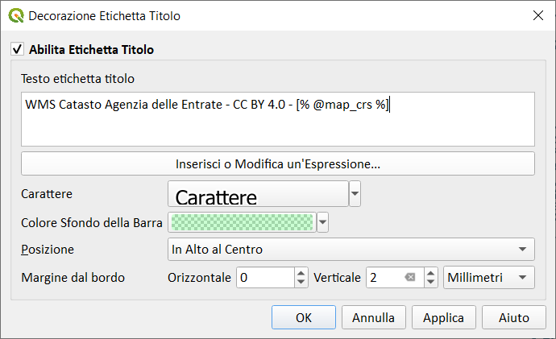</a></p>

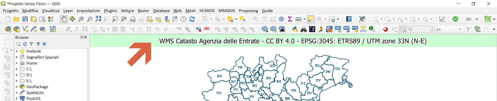

## Servizio WMS

### Come aggiungere il Servizio WMS a QGIS

1. URL: `https://wms.cartografia.agenziaentrate.gov.it/inspire/wms/ows01.php`
2. Gestione delle Sorgentidati | WMS/WMTS | Nuovo :

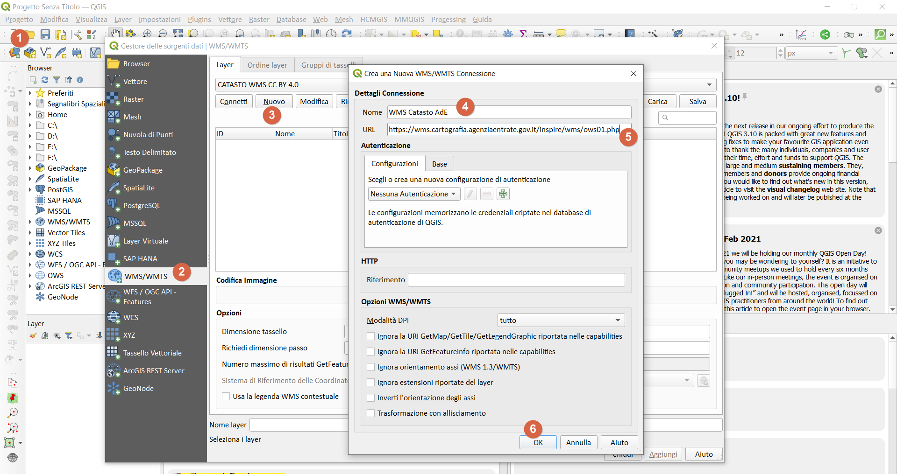

<https://geoportale.cartografia.agenziaentrate.gov.it/age-inspire/srv/ita/catalog.search;jsessionid=2D812F23AA0C878D6F2DE54F9CE259CB.node1#/home>

### Quali dati espone il servizio WMS

1. codice Belfiore;
2. foglio;
3. particella;
4. sezione;
5. allegato;
6. sviluppo

### SR disponibili per il WMS

Il servizio rende consultabili i dati nel Sistema di riferimento geodetico nazionale (Decreto 10 novembre 2011) costituito dalla realizzazione ETRF2000 - all'epoca 2008.0 - del Sistema di riferimento geodetico europeo ETRS89, identificativo EPSG3:6706.

Ai soli fini di una migliore fruibilità del servizio in ambito INSPIRE, sono disponibili i Sistemi di riferimento relativi alla realizzazione ETRF89 (codici EPSG 4258, 25832, 25833, 25834, 3044, 3045, 3046).

- Capabitilis : <https://wms.cartografia.agenziaentrate.gov.it/inspire/wms/ows01.php?SERVICE=WMS&VERSION=1.3.0&REQUEST=GetCapabilities>
- copiate il link di sopra e incollatelo in un browser, poi cercate EPSG, troverete una lista di EPSG utilizzabili.
- Codici Comuni : <https://www1.agenziaentrate.gov.it/servizi/codici/ricerca/VisualizzaTabella.php?ArcName=COM-ICI>

map_crs     |   map_crs_description         | Area of fuse                   | Unit
------------|-------------------------------|--------------------------------|--------
EPSG:6706   | RDN2008                       |  Italy - onshore and offshore  | `degree` 
EPSG:4258   | ETRS89                        |  Europe - onshore and offshore | `degree`
EPSG:3044   | ETRS89 / UTM zone 32N (N-E)   |  Europe between 06°E and 12°E  | metre
EPSG:3045   | ETRS89 / UTM zone 33N (N-E)   |  Europe between 12°E and 18°E  | metre
EPSG:3046   | ETRS89 / UTM zone 34N (N-E)   |  Europe between 18°E and 24°E  | metre
EPSG:25832  | ETRS89 / UTM zone 32N         |  Europe between 06°E and 12°E  | metre
EPSG:25833  | ETRS89 / UTM zone 33N         |  Europe between 12°E and 18°E  | metre
EPSG:25834  | ETRS89 / UTM zone 34N         |  Europe between 18°E and 24°E  | metre

[↑ torna su ↑](#workshop-estate-gis-2021-unipd)

### Layer disponibili nel WMS

nome | Titolo | Scala visualizzazione | GetFeatureInfo
-----|--------|-----------------------|------------
province | Province - Uffici | 1:50.000| n.d.
CP.CadastralZoning| Mappe | 1:200.000 | Campi previsti dalla Direttiva INSPIRE
acque | Acque | 1:40.000 | n.d.
strade | Strade | 1:40.000 | n.d.
CP.CadastralParcel | Particelle | 1:5.000 | Campi previsti dalla Direttiva INSPIRE
fabbricati | Fabbricati | 1:5.000 | n.d.
vestizione | Vestizione | 1:2.000 | n.d.
copyright | Copyright(c) |

[↑ torna su ↑](#workshop-estate-gis-2021-unipd)

## Creare un nuovo GeoPackage

- Per chi volesse avere tutto pronto, scarica geopackage con progetto (posizionato in Sicilia)

Per creare velocemente un nuovo **GeoPackage**, digitare `Ctrl+Shift+N`, altrimenti dal _Menu | Crea Vettore | Nuovo Layer GeoPackage_

<p align="center"><a href="https://qgis.org/it/site/" target="_blank">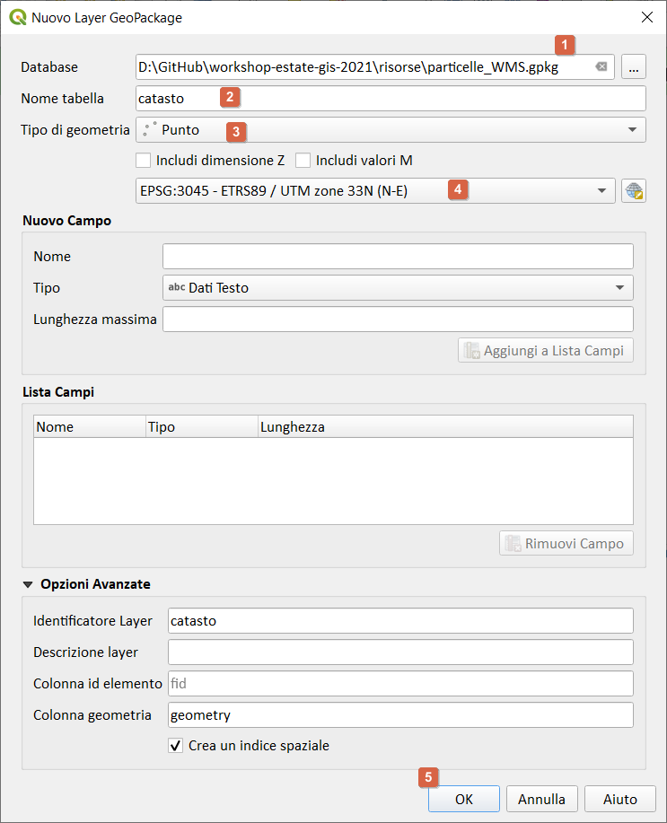</a></p>

1. definire il percorso e nome del GeoPackage;
2. definire il nome della tabella (`catasto`);
3. definire il Tipo di geometria (in questo esempio `Punto`);
4. selezionare EPSG del Progetto (che deve essere EPSG del WMS Catasto);
5. pigiare su `OK`

NB: il GeoPackage creerà automaticamente il campo `fid`, tutti gli altri campi che ci serviranno saranno `campi virtuali` (vedi sotto)

## Impostazioni Progetto

1. definire l'area in cui lavorare (es: un comune);
2. in funzione dell'area, definire EPSG del WMS (proiettato e non geografico);
3. installare la funzione personalizzata;
4. caricare il geopackage appena creato;
5. aggiungere il layer WMS Catasto (vedi punto 2) e selezionare i layer:
   1. Particelle;
   2. vestizione;
   3. copyright
6. occhio alla scala di visualizzazione del layer;

[↑ torna su ↑](#workshop-estate-gis-2021-unipd)

## Espressione personalizzata

Questa espressione personalizzata permette di estrarre i dati esposti dal WMS Catasto

```python
# -*- coding: utf-8 -*-
"""
/***************************************************************************
 WMS Catasto Agenzia delle Entrate CC BY 4.0
                              -------------------
        copyright            : (C) 2020 by Giulio Fattori
        email                : giulio.fattori@tin.it
 ***************************************************************************/
"""

from qgis.core import *
from qgis.gui import *
import requests

@qgsfunction(args='auto', group='Custom')
def get_parcel_info2(xx, yy, EPSG, feature, parent):
    """
    <h1>WMS Catasto Agenzia delle Entrate CC BY 4.0:</h1><br>    
    La funzione, tramite una richiesta GetFeatureInfo, restituisce le informazioni utili sulla particella che ricade sotto il pixel di mio interesse:
    <h2>Esempio:</h2>
    <ul>
      <li>get_parcel_info2(355461.5,4222490.7,'EPSG:3045') -> 'IT.AGE.PLA.G273_0033A0.673'</li>
      <li>get_parcel_info2("fieldX", "fieldY",'EPSG:3045') -> 'IT.AGE.PLA.G273_0033A0.673'</li>
      <li>get_parcel_info2("fieldX", "fieldY",@project_crs) -> 'IT.AGE.PLA.G273_0033A0.673'</li>
    </ul>
    <h2>NB: le coordinate X e Y devono essere espresse nel EPSG utilizzato (gli EPSG disponibili sono:25832/3/4,3044/5/6)</h2>
    """
    req = "https://wms.cartografia.agenziaentrate.gov.it/inspire/wms/ows01.php?REQUEST=GetFeatureInfo&SERVICE=WMS&SRS="+EPSG+"&STYLES=&VERSION=1.1&FORMAT=image/png&BBOX="+str(xx-1)+","+str(yy-1)+","+str(xx+1)+","+str(yy+1)+"&HEIGHT=9&WIDTH=9&LAYERS=CP.CadastralParcel&QUERY_LAYERS=CP.CadastralParcel&INFO_FORMAT=text/html&X=5&Y=5"

    r = requests.get(req, auth=('user', 'pass'))
    a = r.text.partition("InspireId localId</th><td>")[2]
    b = a.partition("</td>")[0]
    return b
```

file da salvare nella cartella del profilo corrente: `C:\Users\nomeUtente\AppData\Roaming\QGIS\QGIS3\profiles\default\python\expressions`

raggiungibile da : Menu | Impostazioni | Profilo utente | Apri la cartella del profilo attivo

<p align="center"><a href="https://qgis.org/it/site/" target="_blank">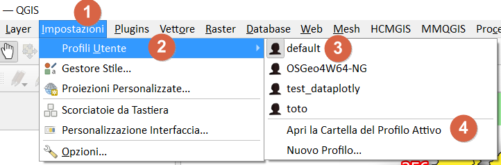</a></p>

la funzione personalizzata nel Gruppo Custom del field calc:

<p align="center"><a href="https://qgis.org/it/site/" target="_blank">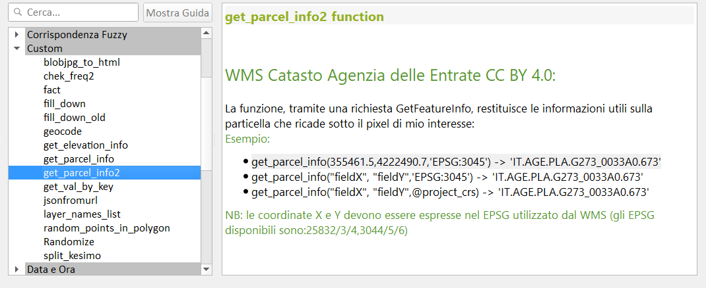</a></p>

[↑ torna su ↑](#workshop-estate-gis-2021-unipd)

## campi virtuali

sotto le espressioni utilizzate nei campi virtuali (i campi virtuali permettono di creare un layer con i campi popolati da espressioni)

Creare un vettore puntuale, per esempio in un GeoPackage e definire solo il campo `fid`, gli altri campi li definiamo come `campi virtuali`, ecco le definizioni:

nome campo | tipo campo | espressione | descrizione
-----------|------------|-------------|-----------
fid | automatico | - | generato dal GeoPackage
x | virtuale | `$x` | coordinata x del punto
y |virtuale | `$y` | coordinata y del punto
catasto | virtuale | `get_parcel_info2("x","y")`| funzione personalizzata
codice | virtuale | `regexp_replace("catasto",'^(.+)\\.(.+)\\.(.+)\\.(.+)_(.+)\\.(.+)$','\\4')` | estrazione codice Belfiore
foglio | virtuale | `regexp_replace("catasto",'^(.+)\\.(.+)\\.(.+)\\.(.+)_(.+)\\.(.+)$','\\5')` | nro foglio
particella | virtuale | `regexp_replace("catasto",'^(.+)\\.(.+)\\.(.+)\\.(.+)_(.+)\\.(.+)$','\\6')` | nro particella

### casi possibili

1. `IT.AGE.PLA.G273_011800.485` caso senza sezione
2. `IT.AGE.PLA.B354A0018V0.2261` caso con sezione

Alcuni comuni presentano delle sezioni e quindi la stringa estratta da `get_parcel_info2()` puo' variare, per tenere conto di questi casi occorre utilizzare le seguenti espressioni:

- codice : 
```
/*campo codice comune 4 caratteri*/
substr(
regexp_replace(  "catasto" ,'^(.+)\\.(.+)\\.(.+)\\.(.+)\\.(.+)$', '\\4'),1,4)
```

- sezione: 
```
/*campo sezione 1 carattere*/
substr(
regexp_replace(  "catasto" ,'^(.+)\\.(.+)\\.(.+)\\.(.+)\\.(.+)$', '\\4'),5,1)
```

- foglio : 
```
/*campo foglio 4 caratteri*/
substr(
regexp_replace(  "catasto" ,'^(.+)\\.(.+)\\.(.+)\\.(.+)\\.(.+)$', '\\4'),6,4)
```
- allegato: 
```
/*campo allegato 1 carattere*/
substr(
regexp_replace(  "catasto" ,'^(.+)\\.(.+)\\.(.+)\\.(.+)\\.(.+)$', '\\4'),10,1)
```

- sviluppo: 
```
/*campo sviluppo 1 carattere*/
substr(
regexp_replace(  "catasto" ,'^(.+)\\.(.+)\\.(.+)\\.(.+)\\.(.+)$', '\\4'),11,1)
```

- particella : 
```
/*campo particella variabile*/
regexp_replace(  "catasto" ,'^(.+)\\.(.+)\\.(.+)\\.(.+)\\.(.+)$', '\\5')
```


<p align="center"><a href="https://qgis.org/it/site/" target="_blank"></a></p>

[↑ torna su ↑](#workshop-estate-gis-2021-unipd)

## Digitalizzazione particelle

### Plugin GIMP Selection Feature

- **GIMP**: <https://www.gimp.org/>
- **Plugin**: <https://plugins.qgis.org/plugins/gimpselectionfeature_plugin/> 


#### Osservazioni

<p align="center"><a href="https://qgis.org/it/site/" target="_blank"></a></p>

* <kbd>id_add</kbd>: l’indice della funzionalità aggiunta;
* <kbd>total_imgs</kbd>: totale delle immagini inviate a GIMP;
* <kbd>images</kbd>: l’elenco delle immagini (nome e origine);
* <kbd>user</kbd>: il nome dell’utente della macchina;
* <kbd>date_add</kbd>: la data dell’elemento aggiunto;
* <kbd>crs_map</kbd>: CRS della mappa quando è stata inviata l’immagine;
* <kbd>extent_map</kbd>: l’estensione della mappa quando l’immagine è stata inviata;
* <kbd>annotation</kbd>: il testo digitato quando l’immagine è stata inviata;
* <kbd>area_ha</kbd>: L’ettaro della geometria (è un campo virtuale) con la seguente espressione da verificare sempre e eventualmente correggere:
* <kbd>area(transform($geometry,'EPSG:4326','EPSG:3045'))/10000</kbd>
* Gimp utilizzato 2.10.24;
* Il SR del livello “gimp_selection” è <kbd>EPSG: 4326</kbd>

#### Workflow

1. Avviare QGIS e installare il Plugin GIMP Selection Feature;
2. Avviare GIMP e verificare che ci siam un menu **IBAMA**;
3. Avviare il servizio dal menu IBAMA;
4. in QGIS caricare il WMS catasto AdE e posizionarsi in un'area;
5. Avviare il plugin da **Menu Raster**;
6. Comparirà la finestra del plugin agganciata sul lato destro dello schermo;
7. nel riquadro `Visible Images` ci sarà l'elenco dei layer raster caricati nella TOC e attivi;
8. dopo aver centrato l'area da digitalizzare nella map canvas: pigiare il bottone `Send image`;
9. dopo qualche secondo, l'immagine della map canvas apparirà in GIMP;
10. usare lo _Strumento seleziona fuzzy_ e cliccare dentro una particella;
11. da QGIS, pigiare sul bottone `Get feature` per acquisire area selezionata come poligono.

Per maggiori info: <https://github.com/lmotta/gimpselectionfeature_plugin/wiki>

### Plugin Magic Wand

- <https://plugins.qgis.org/plugins/MagicWand-master/>


#### Workflow

1. Impostare _Precisione_ e _Soglia_ colore e fare clic sulla mapcanvas dove si desidera creare un poligono;
2. La modalità singola ti consente di creare UN poligono intorno a dove hai cliccato.
3. Una maggiore precisione richiede più tempo.
4. Per rendere il poligono in modo appropriato, è meglio regolare alta la Saturazione.

NB: il poligono che restituisce ha lo stesso EPSG del Progetto.

[↑ torna su ↑](#workshop-estate-gis-2021-unipd)

### estrarre dati dai poligoni

nel caso di poligoni (che hanno un EPSG diversoda quello del WMS):

```
/*estrae il foglio e la particella catastale a partire da un poligono*/
/*con EPSG diverso da quello del WMS*/

with_variable('fp',
		with_variable('geom',
				transform($geometry,'EPSG:4326', @project_crs ),
				get_parcel_info2(
						x( point_on_surface( @geom)),
						y( point_on_surface( @geom)), @project_crs)),
	regexp_replace( @fp ,'^(.+)\\.(.+)\\.(.+)\\.(.+)_(.+)\\.(.+)$', '\\5/\\6')
		    	)
```

```
/*estrae il foglio e la particella catastale a partire da un poligono*/
/*con EPSG uguale a quello del WMS*/

with_variable('fp',
get_parcel_info2(
x( point_on_surface($geometry)),
y( point_on_surface($geometry)),@project_crs),
regexp_replace(@fp ,'^(.+)\\.(.+)\\.(.+)\\.(.+)_(.+)\\.(.+)$', '\\5/\\6')
			)
```

[↑ torna su ↑](#workshop-estate-gis-2021-unipd)

# Cosa occorre

Software con caratteristiche minime per seguire con profitto il workshop

## Software da installare

1. [QGIS 3.16 Hannover](https://qgis.org/it/site/) (o maggiore) ;
2. [GIMP 2.10](https://www.gimp.org/) (attualmente GIMP 2.10.24) ;

##  Plugin da installare

1. [GIMP Selection Feature](https://plugins.qgis.org/plugins/gimpselectionfeature_plugin/) ;
2. [Magic Wand](https://plugins.qgis.org/plugins/MagicWand-master/) ;
3. [Nominatim Locator Filter](https://plugins.qgis.org/plugins/nominatim_locator_filter/) 

[↑ torna su ↑](#workshop-estate-gis-2021-unipd)

# Caratteristiche utilizzate nel progetto

1. servizio WMS;
2. Geopackage;
3. espressioni personalizzate e non;
4. espressioni regolari;
5. campi virtuali;
6. Plugin;
7. GIMP;
8. Etichette con funzione custom.
9. Decorazioni: Copyright, Immagine, Etichetta Titolo.

[↑ torna su ↑](#workshop-estate-gis-2021-unipd)

# Riferimenti utili

- **QGIS** : <https://qgis.org/it/site/>
- **Repo QGIS** : <https://github.com/qgis/QGIS/blob/master/README.md>
- **Plugin Gimp Selection Feature** : <https://plugins.qgis.org/plugins/gimpselectionfeature_plugin/>
- **Plugin Magic Wand** : <https://plugins.qgis.org/plugins/MagicWand-master/>
- **Nominatim Locator Filter** : <https://plugins.qgis.org/plugins/nominatim_locator_filter/>
- **Consultazione cartografia catastale - WMS** : <https://www.agenziaentrate.gov.it/portale/web/guest/schede/fabbricatiterreni/consultazione-cartografia-catastale/servizio-consultazione-cartografia>
- **GIMP** : <https://www.gimp.org/>
- **Font Trueno** : <https://www.wfonts.com/font/trueno>
- **Visual Style Guide** : <https://www.qgis.org/en/site/getinvolved/styleguide.html#trueno-fonts>
- **Visual Studio Code** : <https://code.visualstudio.com/>
- **onData** : <https://ondata.it/>
- **OpenDataSicilia** : <http://opendatasicilia.it/>
- **Blog Post di Andrea Borruso** : <https://medium.com/tantotanto/le-mappa-castali-diventano-finalmente-utilizzabili-821db2f84533>

[↑ torna su ↑](#workshop-estate-gis-2021-unipd)

# Cosa c'è in questo repo

- cartella `imgs` contiene le immagini utilizzate nel progetto .qgs;
- cartella `risorse` contiene i file utilizzati nel progetto, come:
  - geopackage [particelle_WMS.gpkg](https://github.com/pigreco/workshop-estate-gis-2021/raw/main/risorse/particelle_WMS.gpkg);
  - il geopackage contiene due tabelle: la prima si chiama `catasto` la seconda `particelle`;
  - il geopackage contine anche il progetto (`catasto_wms`) che fa uso della tabella `catasto`; la tabella `particella` è vuota, pronta all'uso;
- file `license` è il file che definisce la licenza del repository;
- file `README.md` è questo file, con le info.

[↑ torna su ↑](#workshop-estate-gis-2021-unipd)

# Video demo

Video 1 | Video 2 | Video 3 | Video 4
--------|---------|---------|--------
[](https://youtu.be/Fu-i0zfxndY "Estrarre i dati con il Field Calc di QGIS usando un Punto") | [](https://youtu.be/ujLGbsreqYY "Estrarre i dati catastali a partire da un Poligono") |[](https://youtu.be/GhJwzl8HDs8 "Vettorializzare particelle con il Plugin GIMP Selection Feature") | [](https://youtu.be/DBRHYJOtqFo "Vettotializzare Particelle con il Plugin Magic Wand")

# Licenza

**CC BY 4.0** - <https://creativecommons.org/licenses/by/4.0/deed.it>

[↑ torna su ↑](#workshop-estate-gis-2021-unipd)

## Prossimi eventi

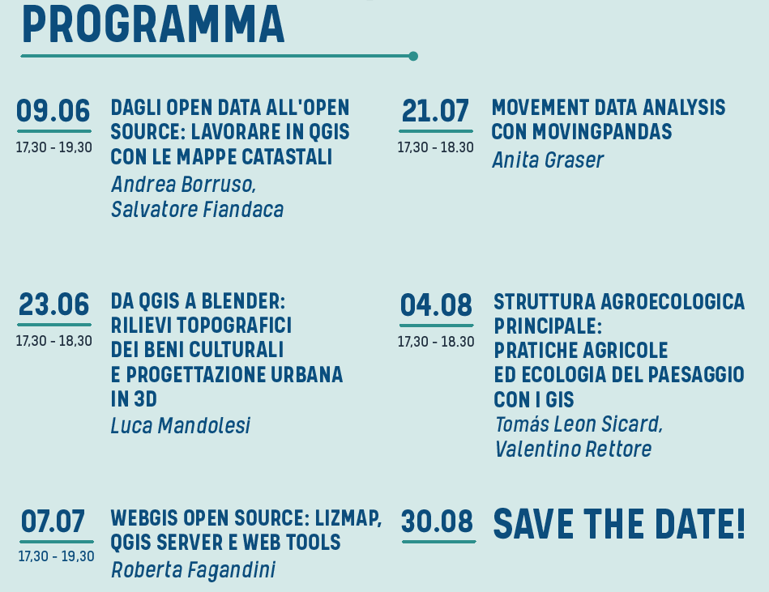