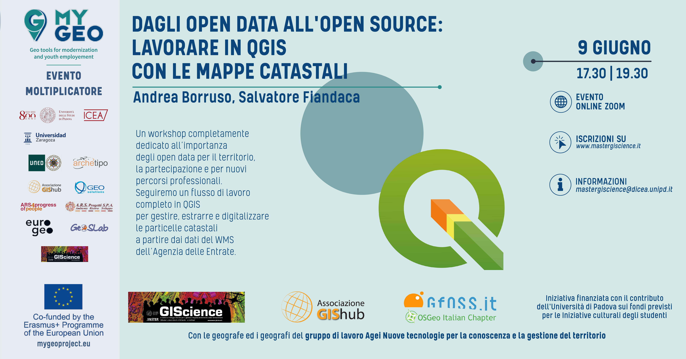
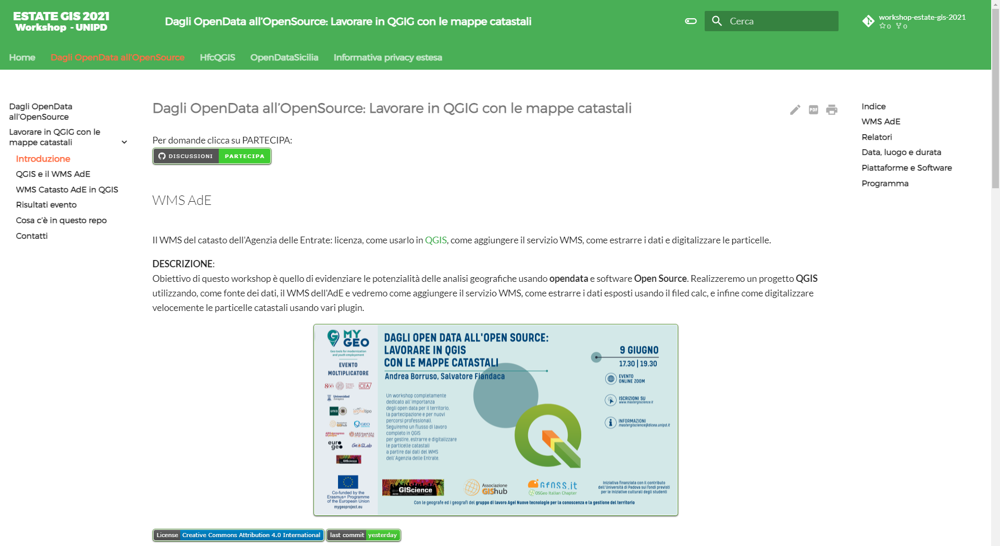

# Workshop estate GIS 2021 UNIPD

Obiettivo di questo workshop è quello di evidenziare le potenzialità delle analisi geografiche usando **opendata** e software **Open Source**. Realizzeremo un progetto **QGIS** utilizzando, come fonte dei dati, il WMS dell'AdE e vedremo come aggiungere il servizio WMS, come estrarre i dati esposti usando il filed calc, e infine come digitalizzare velocemente le particelle catastali usando vari plugin.

---

Workshop estate GIS 2021 UNIPD [Dagli OpenData all’OpenSource: Lavorare in QGIG con le mappe catastali](https://gbvitrano.github.io/workshop-estate-gis-2021/) con [Material for MkDocs](https://squidfunk.github.io/mkdocs-material/)

Scarica l'intervento in formato [pdf](https://gbvitrano.github.io/workshop-estate-gis-2021/Dagli_OpenData_all_OpenSource_%20Lavorare_in_QGIG_con_le_mappe_catastali.pdf)
