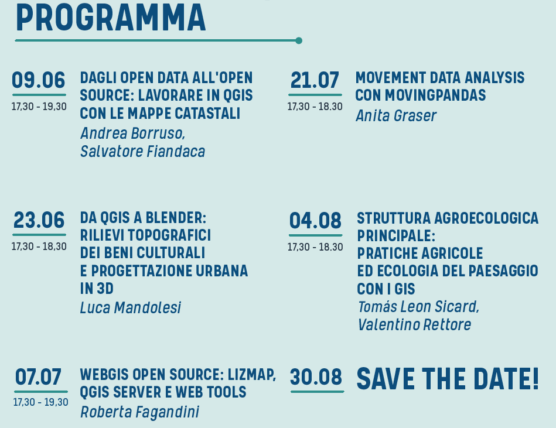

# Dagli OpenData all’OpenSource: Lavorare in QGIG con le mappe catastali

Per domande clicca su PARTECIPA:  

## WMS AdE
  Il WMS del catasto dell'Agenzia delle Entrate: licenza, come usarlo in [QGIS](https://qgis.org/it/site/), come aggiungere il servizio WMS, come estrarre i dati e digitalizzare le particelle.

**DESCRIZIONE**:   Obiettivo di questo workshop è quello di evidenziare le potenzialità delle analisi geografiche usando **opendata** e software **Open Source**. Realizzeremo un progetto **QGIS** utilizzando, come fonte dei dati, il WMS dell'AdE e vedremo come aggiungere il servizio WMS, come estrarre i dati esposti usando il filed calc, e infine come digitalizzare velocemente le particelle catastali usando vari plugin.

## Relatori

- 🧔 [**Andrea BORRUSO**](https://twitter.com/aborruso)  (Membro [OpenDataSicilia](http://opendatasicilia.it/) (2014), Presidente [onData](https://ondata.it/) (2015))

<!--

-->

- 👨‍🦲 **Totò FIANDACA**  (Membro [OpenDataSicilia](http://opendatasicilia.it/) (2014) , Membro [QGIS Italia](http://qgis.it/) (2015), Socio [GFOSS.it](https://gfoss.it/) (2017), Membro [QGIS organization](https://github.com/qgis) (2020))

## Data, luogo e durata

- 🗓 09/06/2021 con orario 🕟 17:30 🕢 19:30 
- 🌐 on-line
- ⏳ 2️⃣ ore

## Piattaforme e Software

- [ZOOM](https://zoom.us/) - per diretta web
- Windows 10 64b - come SO
- [`QGIS 3.16 Hannover`](https://qgis.org/it/site/)  e Plugin [`Gimp Selection feature`](https://github.com/lmotta/gimpselectionfeature_plugin/wiki) e [`Magic Wand`](https://plugins.qgis.org/plugins/MagicWand-master/)
- GIMP 2.10 

## Programma

1. Presentazione iniziale da parte degli organizzatori;
2. **Andrea Borruso:**
   1.  introduzione agli opendata;
   2.  il WMS del Catasto dell'AdE: la licenza prima e dopo del 24/09/2020;
   3.  cosa possiamo farci con il WMS: con QGIS o via script;
3. **Totò Fiandaca:**
   1. come aggiungere il WMS del catasto AdE in QGIS;
   2. come usarle il WMS come layer;
   3. quali layer sono presenti nel WMS e a quale scala sono visibili;
   4. quali SR sono disponibili nel WMS;
   5. come fare una semplice interrogare del WMS in QGIS;
   6. quali dati espone il WMS;
   7. come estrarre i dati esposti dal WMS;
   8. come creare/usare espressioni personalizzate;
   9.  come digitalizzare le particelle in modo veloce;
   10. quali plugin usare per estrarre le particelle;
   11. come fare una semplice interrogare del WMS in QGIS;

---   
   
