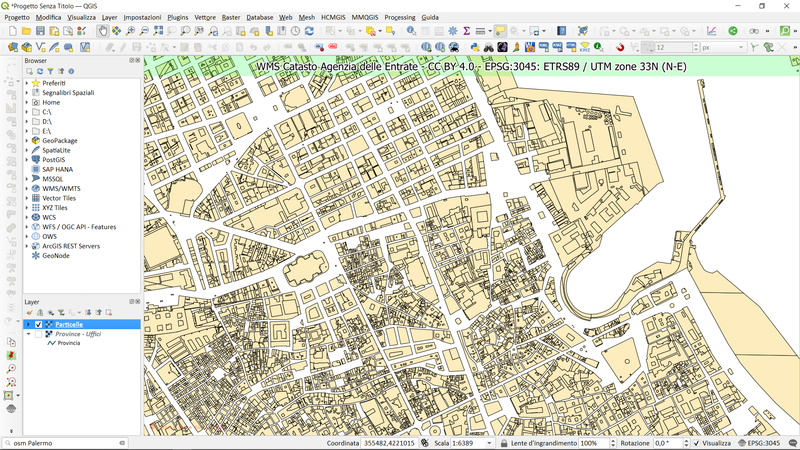

# QGIS e il WMS AdE

## Link utili

- **URL servizio WMS** : https://wms.cartografia.agenziaentrate.gov.it/inspire/wms/ows01.php
- **PDF su WMS** : <https://www.agenziaentrate.gov.it/portale/documents/20143/260417/Manuale+consultazione+cartografia_Documentazione+descrittiva+del+servizio+di+consultazione+della+cartografia+catastale+20180611.pdf/35e955f7-2344-56c8-1157-8f7567531660>
- **Capabilities** : <https://wms.cartografia.agenziaentrate.gov.it/inspire/wms/ows01.php?SERVICE=WMS&VERSION=1.3.0&REQUEST=GetCapabilities>
- **Pagina con URL e licenza** : https://www.agenziaentrate.gov.it/portale/web/guest/schede/fabbricatiterreni/consultazione-cartografia-catastale/servizio-consultazione-cartografia
- **espressione personalizzata**: <https://gist.github.com/pigreco/86589dddf5a59b3a7650267d5af237bd>