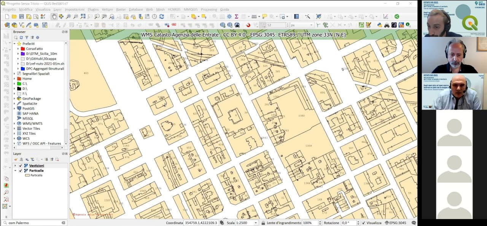

# Risultati evento

- **430** iscritti
- **246** max partecipanti (ZOOM + Facebook)
- diretta Facebook : <https://fb.watch/60JOKALWuj/>

## Domande finali

1. **R. Brascugli chiede:** Il codice Py funziona anche se il layer particelle non è visibile?
   1. dal test effettuato in diretta, sembra di sì; ma non ha molto senso farlo.
2. **Ing. Mario Perrotta:** I campi del vettore ottenuto da GIMP come sono definiti?
   1. la documentazione è presente in questo repository, oppure nel repository del plugin.
3. **Alberto Gallo chiede:** É possibile ripetere il passaggio per creare il campo catasto (get_info_2)?
   1. fatto nella diretta.
4. **Maria Rosa Tremiterra chiede:** Questi metodi di vettorializzazione possono comportare errori topolgici?
   1. In generale no, ma in capi particolari potrebbero esserci.
5. **Salvatore Falanga Bolognesi chiede:** Come mai a partire da dati catastali grezzi (CXF) non riesco ad ottenere la stessa precisione nella georeferenziazione? I tool da me utilizzati sono quelli standard di QGIS (CXF import) e successivamente il software ConveRGo (senza l’utilizzo di grigliati). Il problema sono i tool e/o i dati ancillari?
   1. domanda OFF Topic
6. **Antonio Martire chiede:** È possibile da QGIS (ed eventuale plugin) esportare la rappresentazione grafica del WMS Catasto, in vettoriale disegno, con estensione dxf o dwg?
   1. È possibile esportare il raster e non il vettore.
7. **Giacomo Molisso chiede:** Esiste un modo per interrogare il WMS del catasto al fine di individuare una particella di cui non si conosce la posizione esatta? Come ad esempio avviene con l’applicativo di strimatrix formaps?
   1. È possibile ma non da QGIS, almeno per adesso.
8. **Stefano Nardone chiede:** Dopo l’installazione del plugin GIMP Selection Feature, in GIMP non compare il menú IBAMA come poter risolvere.
   1. Occorrono altre info per poter rispondere adeguatgamente.
9.  **Alessandro D’Andrea chiede:** C’è un modo per ringrandire la visualizzazione del layer vestizioni?
    1. No, dipende da chi ha realizzato il WMS. (Puoi solo intervenire sui `dpi` di stampa, cioè diminuirli e non usare 300 ma 90 per esempio)
10. **Federico Micucci chiede:** Facendo clic su “Send Image” da errore “impossibile stabilire la connessione. Rifiuto persistente del computer di destinazione” Cosa significa?
    1.  Occorrono altre info per poter rispondere.