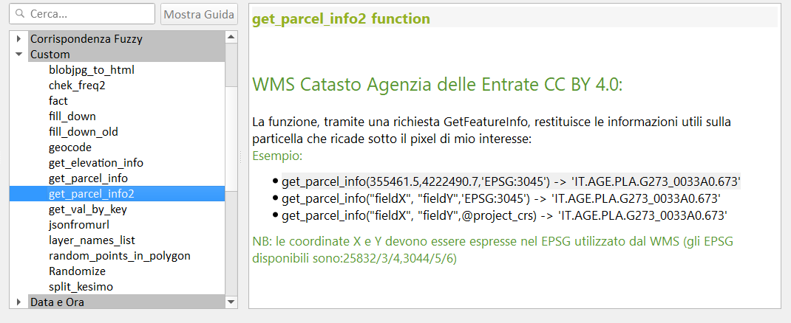

# Decorazione Etichetta Titolo

Creare un nuovo progetto QGIS e aggiungere Decorazione Titolo

### Espressione utilizzata

espressione utilizzata: (Menu: Visualizza | Decorazioni | Etichetta Titolo ...)

```python
WMS Catasto Agenzia delle Entrate - CC BY 4.0 - [% @map_crs ||': '|| @map_crs_description %]
```

<p align="center"><a href="https://qgis.org/it/site/" target="_blank"></a></p>


## Servizio WMS

### Come aggiungere il Servizio WMS a QGIS

1. URL: `https://wms.cartografia.agenziaentrate.gov.it/inspire/wms/ows01.php`
2. Gestione delle Sorgentidati | WMS/WMTS | Nuovo :


<https://geoportale.cartografia.agenziaentrate.gov.it/age-inspire/srv/ita/catalog.search;jsessionid=2D812F23AA0C878D6F2DE54F9CE259CB.node1#/home>

### Quali dati espone il servizio WMS

1. codice Belfiore;
2. foglio;
3. particella;
4. sezione;
5. allegato;
6. sviluppo

### SR disponibili per il WMS

Il servizio rende consultabili i dati nel Sistema di riferimento geodetico nazionale (Decreto 10 novembre 2011) costituito dalla realizzazione ETRF2000 - all'epoca 2008.0 - del Sistema di riferimento geodetico europeo ETRS89, identificativo EPSG3:6706.

Ai soli fini di una migliore fruibilità del servizio in ambito INSPIRE, sono disponibili i Sistemi di riferimento relativi alla realizzazione ETRF89 (codici EPSG 4258, 25832, 25833, 25834, 3044, 3045, 3046).

- Capabitilis : <https://wms.cartografia.agenziaentrate.gov.it/inspire/wms/ows01.php?SERVICE=WMS&VERSION=1.3.0&REQUEST=GetCapabilities>
- copiate il link di sopra e incollatelo in un browser, poi cercate EPSG, troverete una lista di EPSG utilizzabili.
- Codici Comuni : <https://www1.agenziaentrate.gov.it/servizi/codici/ricerca/VisualizzaTabella.php?ArcName=COM-ICI>

map_crs     |   map_crs_description         | Area of fuse                   | Unit
------------|-------------------------------|--------------------------------|--------
EPSG:6706   | RDN2008                       |  Italy - onshore and offshore  | `degree` 
EPSG:4258   | ETRS89                        |  Europe - onshore and offshore | `degree`
EPSG:3044   | ETRS89 / UTM zone 32N (N-E)   |  Europe between 06°E and 12°E  | metre
EPSG:3045   | ETRS89 / UTM zone 33N (N-E)   |  Europe between 12°E and 18°E  | metre
EPSG:3046   | ETRS89 / UTM zone 34N (N-E)   |  Europe between 18°E and 24°E  | metre
EPSG:25832  | ETRS89 / UTM zone 32N         |  Europe between 06°E and 12°E  | metre
EPSG:25833  | ETRS89 / UTM zone 33N         |  Europe between 12°E and 18°E  | metre
EPSG:25834  | ETRS89 / UTM zone 34N         |  Europe between 18°E and 24°E  | metre


### Layer disponibili nel WMS

nome | Titolo | Scala visualizzazione | GetFeatureInfo
-----|--------|-----------------------|------------
province | Province - Uffici | 1:50.000| n.d.
CP.CadastralZoning| Mappe | 1:200.000 | Campi previsti dalla Direttiva INSPIRE
acque | Acque | 1:40.000 | n.d.
strade | Strade | 1:40.000 | n.d.
CP.CadastralParcel | Particelle | 1:5.000 | Campi previsti dalla Direttiva INSPIRE
fabbricati | Fabbricati | 1:5.000 | n.d.
vestizione | Vestizione | 1:2.000 | n.d.
copyright | Copyright(c) |


## Creare un nuovo GeoPackage

- Per chi volesse avere tutto pronto, scarica geopackage con progetto (posizionato in Sicilia)

Per creare velocemente un nuovo **GeoPackage**, digitare `Ctrl+Shift+N`, altrimenti dal _Menu | Crea Vettore | Nuovo Layer GeoPackage_

<p align="center"><a href="https://qgis.org/it/site/" target="_blank"></a></p>

1. definire il percorso e nome del GeoPackage;
2. definire il nome della tabella (`catasto`);
3. definire il Tipo di geometria (in questo esempio `Punto`);
4. selezionare EPSG del Progetto (che deve essere EPSG del WMS Catasto);
5. pigiare su `OK`

NB: il GeoPackage creerà automaticamente il campo `fid`, tutti gli altri campi che ci serviranno saranno `campi virtuali` (vedi sotto)

## Impostazioni Progetto

1. definire l'area in cui lavorare (es: un comune);
2. in funzione dell'area, definire EPSG del WMS (proiettato e non geografico);
3. installare la funzione personalizzata;
4. caricare il geopackage appena creato;
5. aggiungere il layer WMS Catasto (vedi punto 2) e selezionare i layer:
   1. Particelle;
   2. vestizione;
   3. copyright
6. occhio alla scala di visualizzazione del layer;

## Espressione personalizzata

Questa espressione personalizzata permette di estrarre i dati esposti dal WMS Catasto

```python
# -*- coding: utf-8 -*-
"""
/***************************************************************************
 WMS Catasto Agenzia delle Entrate CC BY 4.0
                              -------------------
        copyright            : (C) 2020 by Giulio Fattori
        email                : giulio.fattori@tin.it
 ***************************************************************************/
"""

from qgis.core import *
from qgis.gui import *
import requests

@qgsfunction(args='auto', group='Custom')
def get_parcel_info2(xx, yy, EPSG, feature, parent):
    """
    <h1>WMS Catasto Agenzia delle Entrate CC BY 4.0:</h1><br>    
    La funzione, tramite una richiesta GetFeatureInfo, restituisce le informazioni utili sulla particella che ricade sotto il pixel di mio interesse:
    <h2>Esempio:</h2>
    <ul>
      <li>get_parcel_info2(355461.5,4222490.7,'EPSG:3045') -> 'IT.AGE.PLA.G273_0033A0.673'</li>
      <li>get_parcel_info2("fieldX", "fieldY",'EPSG:3045') -> 'IT.AGE.PLA.G273_0033A0.673'</li>
      <li>get_parcel_info2("fieldX", "fieldY",@project_crs) -> 'IT.AGE.PLA.G273_0033A0.673'</li>
    </ul>
    <h2>NB: le coordinate X e Y devono essere espresse nel EPSG utilizzato (gli EPSG disponibili sono:25832/3/4,3044/5/6)</h2>
    """
    req = "https://wms.cartografia.agenziaentrate.gov.it/inspire/wms/ows01.php?REQUEST=GetFeatureInfo&SERVICE=WMS&SRS="+EPSG+"&STYLES=&VERSION=1.1&FORMAT=image/png&BBOX="+str(xx-1)+","+str(yy-1)+","+str(xx+1)+","+str(yy+1)+"&HEIGHT=9&WIDTH=9&LAYERS=CP.CadastralParcel&QUERY_LAYERS=CP.CadastralParcel&INFO_FORMAT=text/html&X=5&Y=5"

    r = requests.get(req, auth=('user', 'pass'))
    a = r.text.partition("InspireId localId</th><td>")[2]
    b = a.partition("</td>")[0]
    return b
```

file da salvare nella cartella del profilo corrente: `C:\Users\nomeUtente\AppData\Roaming\QGIS\QGIS3\profiles\default\python\expressions`

raggiungibile da : Menu | Impostazioni | Profilo utente | Apri la cartella del profilo attivo

<p align="center"><a href="https://qgis.org/it/site/" target="_blank"></a></p>

la funzione personalizzata nel Gruppo Custom del field calc:

<p align="center"><a href="https://qgis.org/it/site/" target="_blank"></a></p>


## campi virtuali

sotto le espressioni utilizzate nei campi virtuali (i campi virtuali permettono di creare un layer con i campi popolati da espressioni)

Creare un vettore puntuale, per esempio in un GeoPackage e definire solo il campo `fid`, gli altri campi li definiamo come `campi virtuali`, ecco le definizioni:

nome campo | tipo campo | espressione | descrizione
-----------|------------|-------------|-----------
fid | automatico | - | generato dal GeoPackage
x | virtuale | `$x` | coordinata x del punto
y |virtuale | `$y` | coordinata y del punto
catasto | virtuale | `get_parcel_info2("x","y")`| funzione personalizzata
codice | virtuale | `regexp_replace("catasto",'^(.+)\\.(.+)\\.(.+)\\.(.+)_(.+)\\.(.+)$','\\4')` | estrazione codice Belfiore
foglio | virtuale | `regexp_replace("catasto",'^(.+)\\.(.+)\\.(.+)\\.(.+)_(.+)\\.(.+)$','\\5')` | nro foglio
particella | virtuale | `regexp_replace("catasto",'^(.+)\\.(.+)\\.(.+)\\.(.+)_(.+)\\.(.+)$','\\6')` | nro particella

### casi possibili

1. `IT.AGE.PLA.G273_011800.485` caso senza sezione
2. `IT.AGE.PLA.B354A0018V0.2261` caso con sezione

Alcuni comuni presentano delle sezioni e quindi la stringa estratta da `get_parcel_info2()` puo' variare, per tenere conto di questi casi occorre utilizzare le seguenti espressioni:

- codice : 
```
/*campo codice comune 4 caratteri*/
substr(
regexp_replace(  "catasto" ,'^(.+)\\.(.+)\\.(.+)\\.(.+)\\.(.+)$', '\\4'),1,4)
```

- sezione: 
```
/*campo sezione 1 carattere*/
substr(
regexp_replace(  "catasto" ,'^(.+)\\.(.+)\\.(.+)\\.(.+)\\.(.+)$', '\\4'),5,1)
```

- foglio : 
```
/*campo foglio 4 caratteri*/
substr(
regexp_replace(  "catasto" ,'^(.+)\\.(.+)\\.(.+)\\.(.+)\\.(.+)$', '\\4'),6,4)
```
- allegato: 
```
/*campo allegato 1 carattere*/
substr(
regexp_replace(  "catasto" ,'^(.+)\\.(.+)\\.(.+)\\.(.+)\\.(.+)$', '\\4'),10,1)
```

- sviluppo: 
```
/*campo sviluppo 1 carattere*/
substr(
regexp_replace(  "catasto" ,'^(.+)\\.(.+)\\.(.+)\\.(.+)\\.(.+)$', '\\4'),11,1)
```

- particella : 
```
/*campo particella variabile*/
regexp_replace(  "catasto" ,'^(.+)\\.(.+)\\.(.+)\\.(.+)\\.(.+)$', '\\5')
```


<p align="center"><a href="https://qgis.org/it/site/" target="_blank"></a></p>


## Digitalizzazione particelle

### Plugin GIMP Selection Feature

- **GIMP**: <https://www.gimp.org/>
- **Plugin**: <https://plugins.qgis.org/plugins/gimpselectionfeature_plugin/> 


#### Osservazioni

<p align="center"><a href="https://qgis.org/it/site/" target="_blank"></a></p>

* <kbd>id_add</kbd>: l’indice della funzionalità aggiunta;
* <kbd>total_imgs</kbd>: totale delle immagini inviate a GIMP;
* <kbd>images</kbd>: l’elenco delle immagini (nome e origine);
* <kbd>user</kbd>: il nome dell’utente della macchina;
* <kbd>date_add</kbd>: la data dell’elemento aggiunto;
* <kbd>crs_map</kbd>: CRS della mappa quando è stata inviata l’immagine;
* <kbd>extent_map</kbd>: l’estensione della mappa quando l’immagine è stata inviata;
* <kbd>annotation</kbd>: il testo digitato quando l’immagine è stata inviata;
* <kbd>area_ha</kbd>: L’ettaro della geometria (è un campo virtuale) con la seguente espressione da verificare sempre e eventualmente correggere:
* <kbd>area(transform($geometry,'EPSG:4326','EPSG:3045'))/10000</kbd>
* Gimp utilizzato 2.10.24;
* Il SR del livello “gimp_selection” è <kbd>EPSG: 4326</kbd>

#### Workflow

1. Avviare QGIS e installare il Plugin GIMP Selection Feature;
2. Avviare GIMP e verificare che ci siam un menu **IBAMA**;
3. Avviare il servizio dal menu IBAMA;
4. in QGIS caricare il WMS catasto AdE e posizionarsi in un'area;
5. Avviare il plugin da **Menu Raster**;
6. Comparirà la finestra del plugin agganciata sul lato destro dello schermo;
7. nel riquadro `Visible Images` ci sarà l'elenco dei layer raster caricati nella TOC e attivi;
8. dopo aver centrato l'area da digitalizzare nella map canvas: pigiare il bottone `Send image`;
9. dopo qualche secondo, l'immagine della map canvas apparirà in GIMP;
10. usare lo _Strumento seleziona fuzzy_ e cliccare dentro una particella;
11. da QGIS, pigiare sul bottone `Get feature` per acquisire area selezionata come poligono.

Per maggiori info: <https://github.com/lmotta/gimpselectionfeature_plugin/wiki>

### Plugin Magic Wand

- <https://plugins.qgis.org/plugins/MagicWand-master/>


#### Workflow

1. Impostare _Precisione_ e _Soglia_ colore e fare clic sulla mapcanvas dove si desidera creare un poligono;
2. La modalità singola ti consente di creare UN poligono intorno a dove hai cliccato.
3. Una maggiore precisione richiede più tempo.
4. Per rendere il poligono in modo appropriato, è meglio regolare alta la Saturazione.

NB: il poligono che restituisce ha lo stesso EPSG del Progetto.

### estrarre dati dai poligoni

nel caso di poligoni (che hanno un EPSG diversoda quello del WMS):

```
/*estrae il foglio e la particella catastale a partire da un poligono*/
/*con EPSG diverso da quello del WMS*/

with_variable('fp',
		with_variable('geom',
				transform($geometry,'EPSG:4326', @project_crs ),
				get_parcel_info2(
						x( point_on_surface( @geom)),
						y( point_on_surface( @geom)), @project_crs)),
	regexp_replace( @fp ,'^(.+)\\.(.+)\\.(.+)\\.(.+)_(.+)\\.(.+)$', '\\5/\\6')
		    	)
```

```
/*estrae il foglio e la particella catastale a partire da un poligono*/
/*con EPSG uguale a quello del WMS*/

with_variable('fp',
get_parcel_info2(
x( point_on_surface($geometry)),
y( point_on_surface($geometry)),@project_crs),
regexp_replace(@fp ,'^(.+)\\.(.+)\\.(.+)\\.(.+)_(.+)\\.(.+)$', '\\5/\\6')
			)
```

# Cosa occorre

Software con caratteristiche minime per seguire con profitto il workshop

## Software da installare

1. [QGIS 3.16 Hannover](https://qgis.org/it/site/) (o maggiore) ;
2. [GIMP 2.10](https://www.gimp.org/) (attualmente GIMP 2.10.24) ;

##  Plugin da installare

1. [GIMP Selection Feature](https://plugins.qgis.org/plugins/gimpselectionfeature_plugin/) ;
2. [Magic Wand](https://plugins.qgis.org/plugins/MagicWand-master/) ;
3. [Nominatim Locator Filter](https://plugins.qgis.org/plugins/nominatim_locator_filter/) 


# Caratteristiche utilizzate nel progetto

1. servizio WMS;
2. Geopackage;
3. espressioni personalizzate e non;
4. espressioni regolari;
5. campi virtuali;
6. Plugin;
7. GIMP;
8. Etichette con funzione custom.
9. Decorazioni: Copyright, Immagine, Etichetta Titolo.

# Riferimenti utili

- **QGIS** : <https://qgis.org/it/site/>
- **Repo QGIS** : <https://github.com/qgis/QGIS/blob/master/README.md>
- **Plugin Gimp Selection Feature** : <https://plugins.qgis.org/plugins/gimpselectionfeature_plugin/>
- **Plugin Magic Wand** : <https://plugins.qgis.org/plugins/MagicWand-master/>
- **Nominatim Locator Filter** : <https://plugins.qgis.org/plugins/nominatim_locator_filter/>
- **Consultazione cartografia catastale - WMS** : <https://www.agenziaentrate.gov.it/portale/web/guest/schede/fabbricatiterreni/consultazione-cartografia-catastale/servizio-consultazione-cartografia>
- **GIMP** : <https://www.gimp.org/>
- **Font Trueno** : <https://www.wfonts.com/font/trueno>
- **Visual Style Guide** : <https://www.qgis.org/en/site/getinvolved/styleguide.html#trueno-fonts>
- **Visual Studio Code** : <https://code.visualstudio.com/>
- **onData** : <https://ondata.it/>
- **OpenDataSicilia** : <http://opendatasicilia.it/>
- **Blog Post di Andrea Borruso** : <https://medium.com/tantotanto/le-mappa-castali-diventano-finalmente-utilizzabili-821db2f84533>